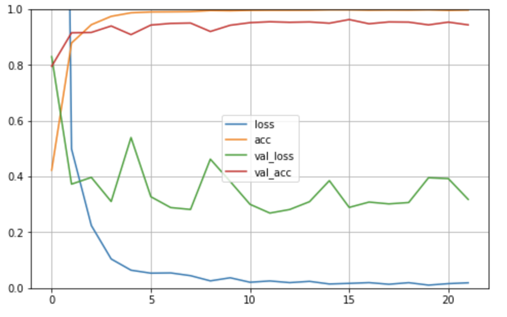

 # DeCAPTCHA

CAPTCHAs (Completely Automated Public Turing test to tell Computers and
Humans Apart) are popular ways of preventing bots from attempting to log
on to systems by extensively searching the password space. In its
traditional form, an image is given which contains a few characters
(sometimes with some obfuscation thrown in). The challenge is to
identify what those characters are and in what order.

## Data Preprocessing

We are given that -

"Each CAPTCHA image in this assignment will be 500 × 150 pixels in size.
Each image will contain a code composed of 3 upper case Greek characters
(i.e. no numerals, punc- tuation marks or lowercase characters). The
font of all these characters would be the same, as would be the font
size. However, each character may be rotated (degree of rotation will
always be either 0&deg;, ±10&deg;, ±20&deg;,
±30&deg; and each character may be rendered with a different
color.

The background color of each image can also change. However, all
background colors are light in shade. Each image also has some stray
lines in the background which are of varying thickness, varying color
and of a shade darker than that of the background. These stray lines are
intended to make the CAPTCHAs more “interesting” and realistic."

Lets take a look at an image from the training data.


### Removing the Background of the Images

In **OpenCV**, there are various colour spaces available to analyze an
image. Since we are focused on removing the lighter pixels (background),
we may try to focus on channels that contain brightness information and
keep the color channels aside, since colors will not affect the data
(training of the ML model).

Lets try playing with the parameters of teh **LAB** colour space. The
luminance channel expresses a lot of info on the amount of brightness in
the image.

Converting to **LAB** colour space,

``` python
lab = cv2.cvtColor(image,cv2.COLOR_BGR2LAB)
l,a,b = cv2.split(lab)
```


We now apply the **cv2.THRESH\_BINARY\_INV** and the flag
**cv2.THRESH\_OTSU**, which uses the **Otsu** algorithm to choose the
optimal threshold value. Now, lets mask the result using **bitwise-and**
to get the masked image.

``` python
ret2,th = cv2.threshold(l,0,255,cv2.THRESH_BINARY_INV+cv2.THRESH_OTSU)
mask = cv2.bitwise_and(image,image,mask=th)
```


But now the background is not what we intended it to be. Lets create an
image with white pixels of the same image dimension (white) and mask the
inverted threshold image with it to get the final result.

``` python
white = np.zeros_like(img)
white = cv2.bitwise_not(white)

result = cv2.bitwise_and(white, white, mask = cv2.bitwise_not(th))
```


We can retrieve the colours of the image if we combine *mask* and
*result*, but since colours will not affect our training anyway, we can
ignore the step.


### Removing the Obfuscating Lines

We will eliminate the eliminate obfuscating lines from the image using
morphological operations - **erosion** and **dilation**. A kernel of
size (2,2) is convolved with the image in **dilation** with 3
iterations. After that, **erosion** is performed on the dilated image
with 2 iterations.

``` python
kernel = np.ones((2, 2), np.uint8)
img_dilation = cv2.dilate(result, kernel, iterations=3)
img_erode = cv2.erode(img_dilation, kernel, iterations=2)
```


The above hyperparameters for **erosion** and **dilation** - kernel
size, number of iterations were obtained after experimentation with
various combinations of the same.

### Segmenting image into pieces, each containing one character

Lets perform segmentation (a form of pixel clustering in images to club
together adjacent pixels that are similar) to find out how many
characters are present in an image.

We performed **Histogram Projection Method** on the eroded image,
vertically. We first created a blank image with the same dimensions as
the eroded image and then used **cv2.line** to populate the blank image.

``` python
# Sum the value lines 
vertical_px = np.sum(removed_image, axis=0)
# Normalize
normalize = vertical_px/255
# Create a black image with zeros 
blankImage = np.ones_like(removed_image) * 255
# Make the vertical projection histogram
for idx, value in enumerate(normalize):
    cv2.line(blankImage, (idx, 0), (idx, height-vector(value)[0]), (0,0,0), 1)
```


Using **Contour Detection**, we can detect the borders of objects, and
localize them easily in an image. We will use the **findContours()** and
**drawContours()** functions from OpenCV to perform contour detection.  
At first we convert the image to grayscale image, then apply **binary
thresholding**. This converts the image to black and white, highlighting
the objects-of-interest to make things easy for the contour-detection
algorithm. Thresholding turns the border of the object in the image
completely white, with all pixels having the same intensity. The
algorithm can now detect the borders of the objects from these white
pixels.

We want to remove contours inside the alphabets. Lets use
**RETR\_EXTERNAL** as the retrieval technique and the
**CHAIN\_APPROX\_SIMPLE** algorithm. However in this case, a big contour
is formed on the whole image, and applying the above returns us that one
big contour.  
So, lets invert the image to avoid this.

``` python
thresh = 255 - thresh
# detect the contours on the binary image using cv2.CHAIN_APPROX_SIMPLE
contours, hierarchy = cv2.findContours(image=thresh, mode=cv2.RETR_EXTERNAL, method=cv2.CHAIN_APPROX_SIMPLE)
                                      
# draw contours on the original image
image_copy = removed_image.copy()
cv2.drawContours(image=image_copy, contours=contours, contourIdx=-1, color=(0, 255, 0), thickness=2, lineType=cv2.LINE_AA)
```


Lets draw bounding boxes now -


Thus, we can easily crop the images now into three different alphabets.
However, lets also look at few corner cases - what if there are multiple
bounding boxes over one alphabet. We can try to see what boxes overlap
and combine them into one.  
  
We will take a look at the coordinates to check which of the boxes
intersect. We are basically looking for connected components in a graph.
Then we can merge the overlapping boxes.


However, even after merging the overlapping boxes, some cases may fail.
So, we decided to apply a threshold - if the height or width is less
than 15 pixels, we choose to ignore them. Finally we get the individual
greek letters.


We are storing the individual greek letters in a list. Initially if we
find more than 3 regions of contouring, we trim the list to the first 3
elements and then sort the list as per the *value of x* to get the names
in correct locations while training the Machine Learning model in the
next step.  
  
\[The Histogram Projection method was not used to segment the images,
however since we tried to segment our images using that approach, we
have included it in our report\]  
  
  

### Training the ML model for Predictions

We decided to train our model on the reference images (24 greek
alphabets). We populated the directory with the rotated versions of the
reference images - ±10&deg;, ±20&deg; and ±30&deg;.
This was done using the **imutils** library.

``` python
imutils.rotate_bound(image, angle)
```

Now, lets build the multi-classification model using **Keras** framework
- **TensorFlow**.

<div id="tab:model-summary-1">

|                                  |                     |          |
| :------------------------------- | :------------------ | :------- |
| Model: sequential                |                     |          |
|                                  |                     |          |
| Layer (type)                     | Output Shape        | Param \# |
| conv2d                           | (None, 138,138,32)  | 896      |
| max\_pooling2d (MaxPooling2D)    | (None, 69, 69, 32)  | 0        |
| conv2d\_1 (Conv2D)               | (None, 67, 67, 64)  | 18496    |
| max\_pooling2d\_1 (MaxPooling2D) | (None, 33, 33, 64)  | 0        |
| conv2d\_2 (Conv2D)               | (None, 31, 31, 128) | 73856    |
| max\_pooling2d\_2 (MaxPooling2D) | (None, 15, 15, 128) | 0        |
| conv2d\_3 (Conv2D)               | (None, 13, 13, 128) | 147584   |
| max\_pooling2d\_3 (MaxPooling2D) | (None, 6, 6, 128)   | 0        |
| flatten (Flatten)                | (None, 4608)        | 0        |
| dense (Dense)                    | (None, 512)         | 2359808  |
| dense\_1 (Dense)                 | (None, 24)          | 12312    |
|                                  |                     |          |
| Total params: 2,612,952          |                     |          |
| Trainable params: 2,612,952      |                     |          |
| Non-trainable params: 0          |                     |          |
|                                  |                     |          |


</div>

The model was trained with a batch size of 50 and 50 epochs. **RMSProp**
was used as the optimizer.  
We used **early stopping** to regularize the ML model. The model gave an
accuracy of about **95.24%**.


Lets try **transfer learning** now.  
We will be using a pre-trained model **InceptionV3** which has been
trained on the image data having 1000 classes. To use a pre-trained
model we need to keep all the previous layers as is and change only the
final layer according to our use case. InceptionV3 has been trained on
1000 image classes. Our problem has only 24 different image classes.
Hence, we will modify the last layer of InceptionV3 to 24 classes.

<div id="tab:model-summary-iv3">

|                                                     |              |          |
| :-------------------------------------------------- | :----------- | :------- |
| Model: iv3                                          |              |          |
|                                                     |              |          |
| Layer (type)                                        | Output Shape | Param \# |
|                                                     |              |          |
| \#\#\#\#\# InceptionV3 layers \#\#\#\#\#\#\#        |              |          |
|                                                     |              |          |
| global\_average\_pooling2d (GlobalAveragePooling2D) | (None, 2048) | 0        |
| dense (Dense)                                       | (None, 512)  | 1049088  |
| dense\_1 (Dense)                                    | (None, 24)   | 12312    |
|                                                     |              |          |
| Total params: 22,864,184                            |              |          |
| Trainable params: 22,829,752                        |              |          |
| Non-trainable params: 34,432                        |              |          |
|                                                     |              |          |


</div>

The model was trained with a batch size of 50, 7 epochs and verbose = 2.
**Adam** was used as the optimizer with learning rate of 0.0001.  
The model gave an accuracy of about **99.21%**.


This model has a size of **276 MB**, since we are importing a
pre-trained model, which has a lot of layers which are unnecessary for
our simpler problem. So, lets look at the previous model - **Model 1**.

However, this model is performing poorly on test data due to the small
size of the training set (24 \* 7 = 168) images. We can use the *train*
directory with 2000 images (of captcha) to train the model. But we have
to pre-process it at first.  
  
**Preprocessing of the train data**

1.  First, lets extract the individual alphabets from the captcha using
    the methods described above.

2.  Then find the corresponding labels from the file *labels.txt*.

This results in a dataset of **6060** images - few images were ignored
(bad images).

Now, the model gives us a training accuracy of **99.82%** and a
validation accuracy of **95.51%**



Now, **eval.py** is run on the **test** directory - it gives us a code
match score of **0.833333**. For the **train** directory provided - the
code match score is **0.973000**.  
  

## References

\[1\] Jeru Lake  (2018) <span>How to remove light shadow-like color from
an image</span> Stack-Overflow.

\[2\] <span>Miscellaneous Image Transformations - Image Procesing</span>
OpenCV Documentation

\[3\] <span>Erosion and Dilation of images using OpenCV</span>
GeekforGeeks

\[4\] <span>Contour Detection using OpenCV (Python/C++)</span>
LearnOpenCV

\[5\] Jochen Ritzel  (2011) <span>Merge lists that share common
elements</span> Stack-Overflow

